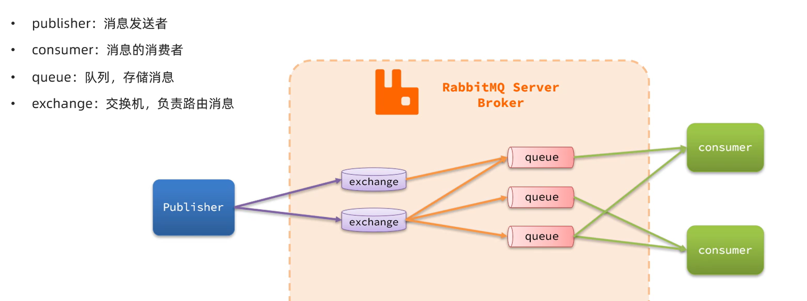
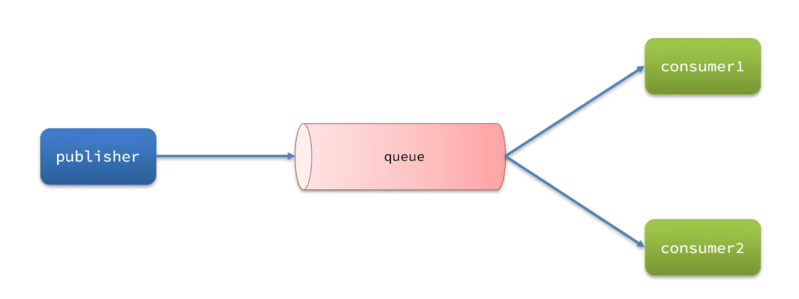
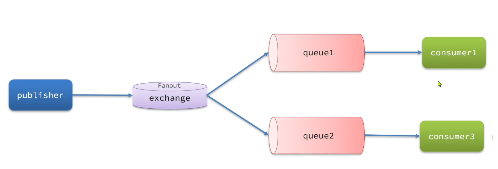
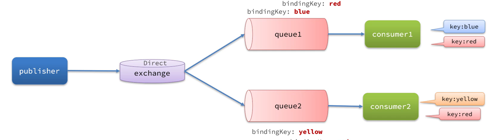
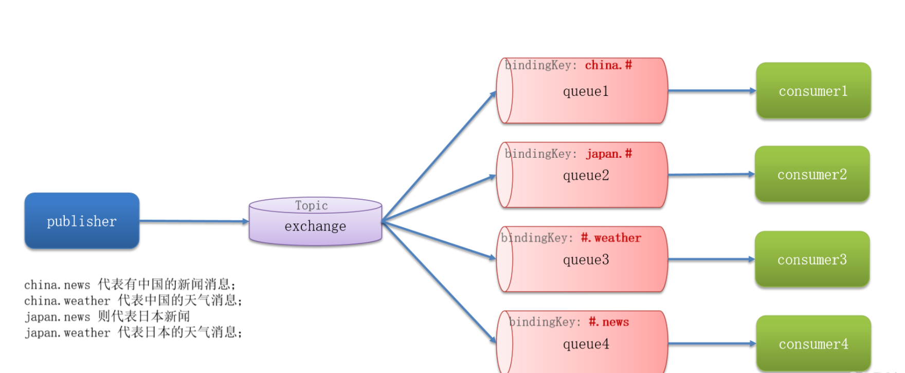
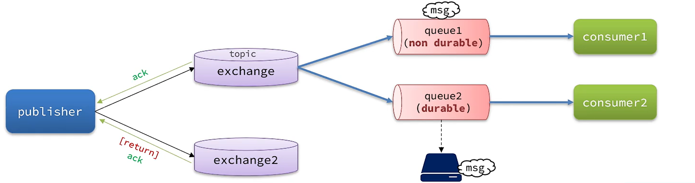
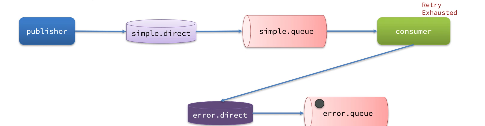

同步调用优点：时效性强，等到结果才返回

缺点：拓展性差 性能差 级联失败

异步调用：消息发送者 消息代理 消息接收者

优点：解耦拓展性强，无需等待性能好，故障隔离，缓存消息流量削峰




**交换机只能路由和转发消息，不能存储消息**


## Work Queues 的概念

> **虽然有多个消费者绑定同一个队列，但是队列中的某一条消息只会被一个消费者消费，默认轮询**



两个队列的消费能力不一样，默认情况下 RabbitMQ 还是会采用轮询的方法将消息分配给每个队列，也就是平均分配

但这不是我们想要的效果，我们想要的效果是消费能力强的消费者处理更多的消息，甚至能够帮助消费能力弱的消费者。怎么样才能达到这样的效果呢，只需要在配置文件中添加以下信息

```yaml
  rabbitmq:
    listener:
      simple:
        prefetch: 1
```

这个配置信息相当于告诉消费者要一条一条地从队列中取出消息，**只有处理完一条消息才能取出下一条**

这样一来，就可以充分利用每一台机器的性能，**让消费能力强的消费者处理更多的消息，同时还可以避免消息在消费能力较弱的消费者上发生堆积的情况**


## 交换机

**真正的生产环境都会经过交换机来发送消息，而不是直接发送到队列**

交换机的作用：

接收 publisher 发送的消息
将消息按照规则路由到与交换机绑定的队列
交换机的类型有以下三种：

1. Fanout：广播
2. Direct：定向
3. Topic：话题

**注意：交换机只能路由和转发消息，不能存储消息**


### Fanout 交换机

**Fanout 交换机会将接收到的消息广播到每一个跟其绑定的 queue ，所以也叫广播模式**




### Direct 交换机

**Direct 交换机会将接收到的消息根据规则路由到指定的队列，被称为定向路由**

- 每一个 Queue 都与 Exchange 设置一个 bindingKey
- 发布者发送消息时，指定消息的 RoutingKey
- Exchange 将消息路由到 bindingKey 与消息 routingKey 一致的队列

需要注意的是：**同一个队列可以绑定多个 bindingKey ，如果有多个队列绑定了同一个 bindingKey ，就可以实现类似于 Fanout 交换机的效果。由此可以看出，Direct 交换机的功能比 Fanout 交换机更强大**

------




### Topic 交换机（推荐使用）

**Topic Exchange 与 Direct Exchange类似，区别在于 Topic Exchange 的 routingKey 可以是多个单词的列表（多个 routingKey 之间以.分割）**

------

Queue 与 Exchange 指定 bindingKey 时可以使用通配符

#：代指 0 个或多个单词
*：代指 1 个单词




- **Topic 交换机能实现的功能 Direct 交换机也能实现，不过用 Topic 交换机实现起来更加方便**
- **如果某条消息的 topic 符合多个 queue 的 bindingKey ，该条消息会发送给符合条件的所有 queue，实现类似于 Fanout 交换机的效果**


## 在 SpringBoot 项目中声明队列和交换机的方式


### 1. SpringAQMP提供的创建队列和交换机的类(基于bean)

SpringAMQP 提供了几个类，用来声明队列、交换机及其绑定关系：

- **Queue：用于声明队列，可以用工厂类 QueueBuilder 构建**
- **Exchange：用于声明交换机，可以用工厂类 ExchangeBuilder 构建**
- **Binding：用于声明队列和交换机的绑定关系，可以用工厂类 BindingBuilder 构建**


------

###### **示例：创建Fanout 类型的交换机，并且创建队列与这个交换机绑定**

```java
//在消费者端声明
@Configuration
public class FanoutConfiguration {

    //声明交换机
    @Bean
    public FanoutExchange fanoutExchange() {
        return ExchangeBuilder.fanoutExchange("notebook.fanout").build();
    }

    //声明队列
    @Bean
    public Queue fanoutQueue() {
        return QueueBuilder.durable("fanout.queue").build();
    }

    //绑定队列和交换机
    @Bean
    public Binding fanoutBinding(Queue fanoutQueue, FanoutExchange fanoutExchange) {
        return BindingBuilder.bind(fanoutQueue).to(fanoutExchange);
    }
}
```


###### **示例：创建Direct类型的交换机，并且创建队列与这个交换机绑定**

```java
//在消费者端声明
@Configuration
public class DirectConfiguration {

    //声明交换机
    @Bean
    public DirectExchange directExchange() {
        return ExchangeBuilder.DirecttExchange("notebook.direct").build();
    }

    //声明队列
    @Bean
    public Queue DirectQueue() {
        return QueueBuilder.durable("direct.queue").build();
    }

    //绑定队列和交换机
    @Bean
    public Binding DirectBinding(Queue DirectQueue, DirectExchange directExchange) {
        return BindingBuilder.bind(directQueue).to(directExchange).with("your-routingkey");
    }
}
```

- **基于bean声明有一个缺点，当队列和交换机之间绑定的 routingKey 有很多个时，编码将会变得十分麻烦**


### 2.基于@RabbitListener注解声明

在消费者监听方法上直接定义交换机和队列并进行绑定

```java

@RabbitListener(bindings = @QueueBinding(
        value = @Queue(name = "direct.queue"),
        exchange = @Exchange(name = "notebook.direct", type = ExchangeTypes.DIRECT),
        key = {"red", "blue"}
))
public void listenDirectQueue(String message) {
    System.out.println("消费者 收到了 direct.queue的消息：【" + message + "】");
}
```


### 3.声明消息转换器（推荐）

使用rabbitMQ发送消息时，默认使用JDK序列化，所以要切换到JSON序列化的

Spring Boot 并不会自动配置 JSON 转换器。你需要在一个 `@Configuration` 类中显式地配置 `Jackson2JsonMessageConverter`

```java
//在生产者和消费者服务中都需要进行声明

@Configuration
public class AMQPConfig {

    @Bean
    public MessageConverter messageConverter() {
        // 使用 Jackson2JsonMessageConverter 作为 Bean，以覆盖默认的 JDK 序列化方式
        return new Jackson2JsonMessageConverter();
    }
}
```

**为什么两边都需要？**

- **生产者端**：`RabbitTemplate` 需要 `MessageConverter` 来把 Java 对象序列化成消息体（JSON 格式）。
- **消费者端**：`@RabbitListener` 注解的方法参数（比如 `Order order`）需要 `MessageConverter` 把接收到的 JSON 消息反序列化成 Java 对象。

Spring Boot 在两边都会检查 `MessageConverter` 类型的 Bean，你只需在两边的 Spring Boot 应用中分别做同样的配置即可。


------

## 消息可靠性

从生产者、消息代理（ RabbitMQ ）、消费者三个方面来保证


### 1.1 生产者连接重试

由于网络问题，可能会出现客户端连接 RabbitMQ 失败的情况，我们可以通过配置开启连接 RabbitMQ 失败后的重连机制。

配置生产者配置文件

```yaml
spring:
  rabbitmq:
    host: 127.0.0.1
    port: 5672
    virtual-host: /notebook
    username: username
    password: 123
    connection-timeout: 1s # 连接超时时间
    template:
      retry:
        enabled: true # 开启连接超时重试机制
        initial-interval: 1000ms # 连接失败后的初始等待时间
        multiplier: 1 # 连接失败后的等待时长倍数，下次等待时长 = (initial-interval) * multiplier
        max-attempts: 3 # 最大重试次数
```


**注意事项：**

- 当网络不稳定的时候，利用重试机制可以有效提高消息发送的成功率，但 **SpringAMOP 提供的重试机制是阻塞式的重试**，也就是说多次重试等待的过程中，线程会被阻塞，影响业务性能
- **如果对于业务性能有要求，建议禁用重试机制。如果一定要使用，请合理配置等待时长（比如 200 ms）和重试次数**，也可以考虑使用异步线程来执行发送消息的代码


### 1.2 生产者确认

RabbitMQ 提供了 `Publisher Confirm` 和 `Publisher Return` 两种确认机制。开启确机制认后，如果 MQ 成功收到消息后，会返回确认消息给生产者，它是一个异步机制，主要由两个核心回调组成，分别负责监控消息流转的不同阶段。返回的结果有以下几种情况

1. 消息投递到了 MQ，但是路由失败，此时会通过 `Publisher Return`  机制返回路由异常的原因，然后返回 ACK，告知生产者消息投递成功
2. 临时消息投递到了 MQ，并且入队成功，返回 ACK，告知生产者消息投递成功
3. 持久消息投递到了MQ，并且入队完成持久化，返回 ACK，告知生产者消息投递成功
4. 其它情况都会返回 NACK，告知生产者消息投递失败





**换句话说，只要消息成功到达了MQ，就会收到ACK。利用这种机制，基本可以保证消息一定可以到达MQ**


#### **A.`ConfirmCallback` (确认消息是否到达 Exchange)**

- **作用：** 消息从生产者发送到 RabbitMQ 服务器后，无论是否成功到达 **Exchange（交换机）**，都会触发此回调。

- **结果：**  `ack = true`：消息成功到达 Exchange。

  `ack = false` (nack)：消息未能到达 Exchange（例如 Exchange 不存在，或者网络闪断）。


#### B. `ReturnCallback` (确认消息是否被路由到 Queue)

- **作用：** 消息到达 Exchange 后，如果**无法根据 Routing Key 路由到任何 Queue（队列）**，触发此回调。
- **注意：** 如果消息成功路由到了队列，这个回调**不会**被触发。只有在路由失败时（例如使用了错误的 Routing Key）才会退回消息。前提是发送消息时必须设置 `mandatory = true`。


应用步骤：

1. **修改配置文件 (`application.yml`)** 开启确认机制：

```yaml
spring:
  rabbitmq:
    # 开启 ConfirmCallback (correlated：表示异步确认，none：关闭，simple：以同步阻塞等待的方式返回 MQ 的回执消息）
    publisher-confirm-type: correlated
    # 开启 ReturnCallback (当消息无法路由到队列时退回)
    publisher-returns: true
    template:
      # 必须设置为 true，ReturnCallback 才会生效
      mandatory: true
```

2. **在代码中配置回调接口** 你需要为 `RabbitTemplate` 设置这两个回调：

```java
@Slf4j
@Component
public class RabbitMQConfirmConfig {

    //每个 RabbitTemplate 只能配置一个 ReturnCallback
    @Autowired
    private RabbitTemplate rabbitTemplate;

    @PostConstruct
    public void init() {
        // 1. 设置 ConfirmCallback (到达 Exchange 的确认)
        rabbitTemplate.setConfirmCallback((correlationData, ack, cause) -> {
            String id = correlationData != null ? correlationData.getId() : "未知ID";
            if (ack) {
                log.info("消息成功到达 Exchange, 消息ID: {}", id);
            } else {
                log.error("消息未能到达 Exchange, 消息ID: {}, 失败原因: {}", id, cause);
                // TODO: 这里可以进行消息重发或记录到数据库进行人工干预
            }
        });

        // 2. 设置 ReturnCallback (路由到 Queue 失败时的退回)
        rabbitTemplate.setReturnsCallback(returnedMessage -> {
            log.error("消息路由失败！");
            log.error("消息主体: {}", new String(returnedMessage.getMessage().getBody()));
            log.error("应答码: {}", returnedMessage.getReplyCode());
            log.error("原因描述: {}", returnedMessage.getReplyText());
            log.error("使用的交换机: {}", returnedMessage.getExchange());
            log.error("使用的路由键: {}", returnedMessage.getRoutingKey());
            // TODO: 这里可以处理无法路由的消息，例如保存到异常表
        });
    }
}
```

**总结：通过`ConfirmCallback`返回的的结果（ack）可以确认是否消息到达交换机；通过`ReturnCallback`是否被触发（投递到队列失败被触发）来确认消息是否到达队列。**

**在生产环境中，开启 `publisher-confirm-type: correlated` 和 `publisher-returns: true`。当收到 `ack=false` 或触发路由失败时，将失败的消息落库（写入数据库记录），然后通过定时任务进行补偿重试，这是保证消息百分百投递成功的标准做法。**


### 2. 1 MQ的可靠性：数据持久化（整体性能较弱）


在默认情况下，RabbitMQ 会将接收到的信息保存在内存中以降低消息收发的延迟，这样会导致两个问题：

1. 一旦 RabbitMQ 宕机，内存中的消息会丢失
2. 内存空间是有限的，当消费者处理过慢或者消费者出现故障或时，会导致消息积压，引发 MQ 阻塞（ Paged Out 现象）


怎么理解 MQ 阻塞呢，当队列的空间被消息占满了之后，RabbitMQ 会先把老旧的信息存到磁盘，为新消息腾出空间，在这个过程中，整个 MQ 是被阻塞的，也就是说，在 MQ 完成这一系列工作之前，无法处理已有的消息和接收新的消息。


**RabbitMQ 实现数据持久化包括 3 个方面**：

1. 交换机持久化
2. 队列持久化
3. 消息持久化**（当message被设置为非持久化non-presistent时，会引发paged out，消息暂停接收，全力将内存中的消息落盘）**

------

注意事项：

利用 SpringAMQP 创建的交换机、队列、消息，默认都是持久化的
在 RabbitMQ 控制台创建的交换机、队列默认是持久化的，而消息默认是存在内存中（ 3.12 版本之前默认存放在内存，3.12 版本及之后默认先存放在磁盘，消费者处理消息时才会将消息取出来放到内存中）

**总而言之，使用数据持久化，就是将到达队列的消息在写入内存的同时也写入磁盘中，保证到达队列的消息的安全性**


### 2.2 MQ的可靠性：LazyQueue

从 RabbitMQ 的 3.6.0 版本开始，增加了 Lazy Queue 的概念，也就是惰性队列，惰性队列的特征如下：

- 接收到消息后**直接存入磁盘而非内存**（内存中只保留最近的消息，默认 2048条 )
- 消费者要处理消息时才会从磁盘中读取并加载到内存
- 支持数百万条的消息存储，**在 3.12 版本后，所有队列默认 Lazy Queue 模式**


**开启持久化和生产者确认时，RabbitMQ 只有在消息持久化完成后才会给生产者返回 ACK 回执**

------


| **队列类型**                | **消息写入时**        | **默认的内存留存策略**                                     | **消费者读取时**                               |
| --------------------------- | --------------------- | ---------------------------------------------------------- | ---------------------------------------------- |
| **老惰性队列** *(已隐退)*   | 直接写盘              | 内存只留索引，不留任何消息体                               | **必须读盘**                                   |
| **经典队列 v2** *(CQv2)*    | 直接写盘              | 动态滚动缓存（最多 2048 条小消息），大消息（>4KB）不留内存 | 命中缓存则**免读盘**；积压或大消息则**需读盘** |
| **仲裁队列** *(QQ)*         | 强同步刷盘 (Raft WAL) | 默认全留内存（以空间换时间）                               | 默认**免读盘**（直接走内存缓存）               |
| **仲裁队列** *(限制内存版)* | 强同步刷盘 (Raft WAL) | 设置 `x-max-in-memory-length=0`，落盘后立刻清空内存        | **必须读盘**                                   |

在实际的分布式系统开发中：

1. 如果你需要**高并发、高吞吐**，且允许短暂的消费者等待，直接用默认的**仲裁队列**。
2. 如果你的业务经常出现**数百万级的恶意积压**（比如下游系统天天断线），且服务器内存吃紧，记得给仲裁队列加上 `x-max-in-memory-length: 0`，让它彻底“惰性化”，把压力全部卸给磁盘。


### 3.1消费者的可靠性：消费者确认机制

为了确认消费者是否成功处理消息，RabbitMQ 提供了消费者确认机制（Consumer Acknowledgement）

处理消息后，消费者应该向 RabbitMQ 发送一个回执，告知 RabbitMQ 消息的处理状态，回执有三种可选值：

- ack：成功处理消息，RabbitMQ 从队列中删除该消息

- nack：消息处理失败，RabbitMQ 需要再次投递消息
- reject：消息处理失败并拒绝该消息，RabbitMQ 从队列中删除该消息

**但是SpringAMQP 已经实现了消息确认功能，并允许我们通过配置文件选择 ACK 的处理方式**，有三种方式：

- none：不处理，即消息投递给消费者后立刻 ack，消息会会立刻从 MQ 中删除，非常不安全，不建议使用
- manual：手动模式。需要自己在业务代码中调用 api，发送 ack 或 reject ，存在业务入侵，但更灵活
- auto（最常使用）：自动模式，SpringAMQP 利用 AOP 对我们的消息处理逻辑做了环绕增强，当业务正常执行时则自动返回 ack，当业务出现异常时，会根据异常的类型返回不同结果：如果是业务异常，会自动返回 nack，如果是消息处理或校验异常，自动返回 reject

```yaml
spring:
  rabbitmq:
    listener:
      simple:
        prefetch: 1
        acknowledge-mode: auto
```

**auto模式在listener抛出异常**时，Spring 容器会敏锐地捕捉到，并在后台自动帮你调用 `channel.basicNack(..., requeue=true)`，**让消息重新回到队列**。那么这样就可能引发无限次的重试，使得进入**死循环**。为了解决这个问题，我们引入了**本地重试机制**


### 3.2 消费者的可靠性：本地确认机制

```yaml
spring:
  rabbitmq:
    listener:
      simple:
        acknowledge-mode: auto # 开启 Spring 自动确认机制
        retry:
          enabled: true       # 开启本地重试
          max-attempts: 3     # 最大重试次数（包括第一次）
          initial-interval: 1000ms # 重试间隔
```


**开启本地重试后的流程：**

1. 消息到达消费者，业务执行抛出异常。
2. **重点：** Spring 此时**不会**去通知 RabbitMQ。它在 Java 进程内部（本地内存中）把这个异常拦截下来，等待 1 秒钟，然后再次调用你的 Listener 方法。
3. 如果重试 3 次全部失败，Spring 就会认为这个消息确实搞不定了，触发它的**消息恢复策略（MessageRecoverer）**


**当本地重试 3 次都失败后，Spring 提供了三种策略：**

1. **RejectAndDontRequeueRecoverer（默认策略）：** Spring 容器会在后台向 RabbitMQ 发送一个 `basicReject(..., requeue=false)`。
   - 如果该队列配置了**死信队列（DLX）**，这条消息会优雅地流入死信队列。
   - 如果没有配置死信队列，这条消息会被 RabbitMQ **直接丢弃**。
2. **ImmediateRequeueMessageRecoverer：** 向 MQ 发送 `basicNack(..., requeue=true)`。这又会把消息扔回 MQ 队列重新排队。**生产环境千万别用**，会重新引发死循环。
3. **RepublishMessageRecoverer（非常推荐）：** 当重试耗尽后，Spring 会把这条消息包装一下（加上异常堆栈信息作为 Header），然后重新发布（Publish）到一个你专门指定的“异常捕获交换机/队列”中，供后续人工排查。


举例**RepublishMessageRecoverer**：



1. **定义一个专门处理异常和错误的交换机/队列 ，并将队列和交换机进行绑定**

```java
@Configuration
@ConditionalOnProperty(prefix = "spring.rabbitmq.listener.simple.retry", name = "enabled", havingValue = "true")
public class ErrorConfiguration {

    @Bean
    public DirectExchange errorExchange() {
        return new DirectExchange("notebook.error", true, false);
    }

    @Bean
    public Queue errorQueue() {
        return new Queue("error.queue", true, false, false);
    }

    @Bean
    public Binding errorBinding(Queue errorQueue, DirectExchange errorExchange) {
        return BindingBuilder.bind(errorQueue).to(errorExchange).with("error");
    }

}
```

2. 将**失败处理策略改为 RepublishMessageRecoverer** （开起了消费者重试机制才会生效）

```java
@Bean
public MessageRecoverer messageRecoverer(RabbitTemplate rabbitTemplate) {
    return new RepublishMessageRecoverer(rabbitTemplate, "error.direct", "error");
}
```


**总结：消费者如何保证消息一定被消费?**

1. **开启消费者确认机制为 auto ，由 Spring 帮我们确认，消息处理成功后返回 ack，异常时返回 nack**
2. **开启消费者失败重试机制，并设置 `MessageRecoverer` ，多次重试失败后将消息投递到异常交换机，交由人工处理**


